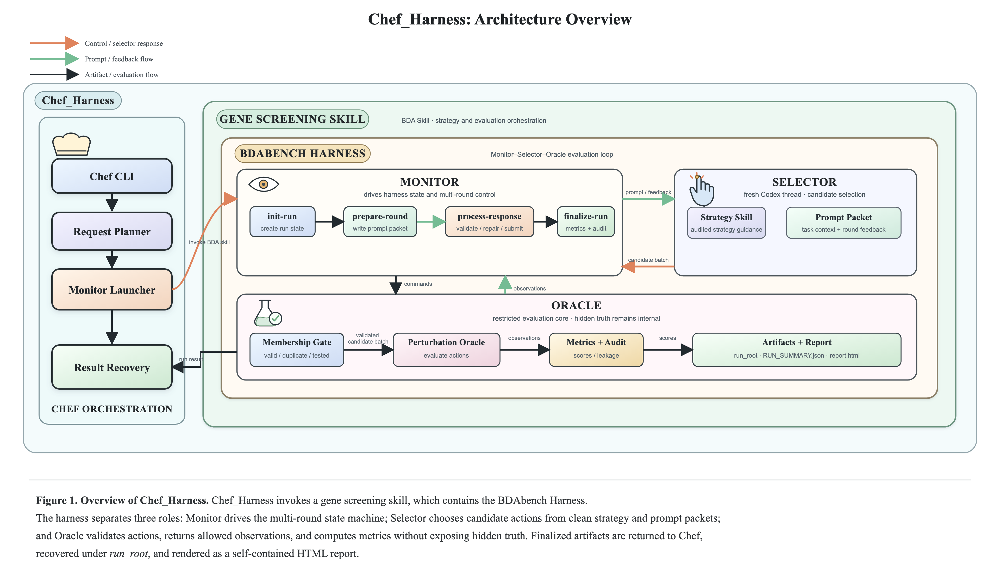

# PerturbTrace

Evaluating Feedback Use by AI Co-Scientist Agents in Perturbation Discovery

## What's in this repo

| Path | Description |
|---|---|
| [`benchmarks/bdabench/`](./benchmarks/bdabench/) | PerturbTraceBench |
| [`Chef_Harness/`](./Chef_Harness/) | PerturbTrace Framework |

## BDAbench

Each task keeps ground truth inside a hidden oracle. The solver only sees the public brief, the candidate list, and the observations the harness is allowed to return after each batch.

Typical protocol: **5 rounds**, a fixed batch size (often 128 genes), then metrics such as top-effect recall plus a leakage audit. Feedback can be `true_feedback`, `no_feedback`, `random_feedback`, or `stale_feedback`.

| Task | Screen | Action |
|---|---|---|
| [`c3_il2_feedback_decision_v0`](./benchmarks/bdabench/tasks/c3_il2_feedback_decision_v0/public_task_brief.md) | Primary T-cell IL2 | gene |
| [`c3_ifng_feedback_decision_v0`](./benchmarks/bdabench/tasks/c3_ifng_feedback_decision_v0/public_task_brief.md) | Primary T-cell IFNG | gene |
| [`c3_cart_adenosine_feedback_decision_v0`](./benchmarks/bdabench/tasks/c3_cart_adenosine_feedback_decision_v0/public_task_brief.md) | CAR-T adenosine | gene |
| [`c3_cart_crispra_exhaustion_feedback_decision_v0`](./benchmarks/bdabench/tasks/c3_cart_crispra_exhaustion_feedback_decision_v0/public_task_brief.md) | CAR-T CRISPRa exhaustion | gene activation |
| [`c3_cart_exposure_resistance_crispr_screen_v0`](./benchmarks/bdabench/tasks/c3_cart_exposure_resistance_crispr_screen_v0/public_task_brief.md) | CAR-T exposure (HuPT3) | gene |
| [`c3_cart_exposure_resistance_kp4_crispr_screen_v0`](./benchmarks/bdabench/tasks/c3_cart_exposure_resistance_kp4_crispr_screen_v0/public_task_brief.md) | CAR-T exposure (KP4) | gene |
| [`c3_choline_recycling_feedback_decision_v0`](./benchmarks/bdabench/tasks/c3_choline_recycling_feedback_decision_v0/public_task_brief.md) | Lysosomal choline recycling | gene |
| [`c3_tau_absolute_feedback_decision_v0`](./benchmarks/bdabench/tasks/c3_tau_absolute_feedback_decision_v0/public_task_brief.md) | Endogenous tau | gene |
| [`c3_tau_decrease_feedback_decision_v0`](./benchmarks/bdabench/tasks/c3_tau_decrease_feedback_decision_v0/public_task_brief.md) | Tau-lowering | gene |
| [`c3_primary_tcell_function_screen_v0`](./benchmarks/bdabench/tasks/c3_primary_tcell_function_screen_v0/public_task_brief.md) | Primary T-cell function | gene |
| [`c3_nk_cell_exposure_crispr_v0`](./benchmarks/bdabench/tasks/c3_nk_cell_exposure_crispr_v0/public_task_brief.md) | NK-cell exposure | gene |
| [`c3_phagocytosis_crispr_screen_v0`](./benchmarks/bdabench/tasks/c3_phagocytosis_crispr_screen_v0/public_task_brief.md) | Phagocytosis | gene |
| [`c3_crispr_selection_human_cells_v0`](./benchmarks/bdabench/tasks/c3_crispr_selection_human_cells_v0/public_task_brief.md) | CRISPR selection in human cells | gene |
| [`c3_depmap_single_line_dependency_v0`](./benchmarks/bdabench/tasks/c3_depmap_single_line_dependency_v0/public_task_brief.md) | DepMap / Achilles dependency | gene |
| [`c3_project_drive_dependency_v0`](./benchmarks/bdabench/tasks/c3_project_drive_dependency_v0/public_task_brief.md) | Project DRIVE RNAi dependency | gene |
| [`c3_gdsc_drug_response_v0`](./benchmarks/bdabench/tasks/c3_gdsc_drug_response_v0/public_task_brief.md) | GDSC drug response | drug |
| [`c3_cell_painting_morphology_v0`](./benchmarks/bdabench/tasks/c3_cell_painting_morphology_v0/public_task_brief.md) | JUMP Cell Painting morphology | compound or gene |

## Chef_Harness

Install and other tasks: [`Chef_Harness/README.md`](./Chef_Harness/README.md).

<video src="./Chef_Harness/docs/chef-run-bda-c3-il2-full.mp4" controls width="100%"></video>

[Watch a full 5-round run of `c3_il2_feedback_decision_v0`](./Chef_Harness/docs/chef-run-bda-c3-il2-full.mp4)

## License

[MIT](./LICENSE)
